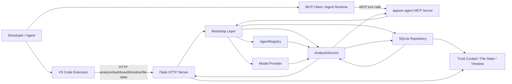
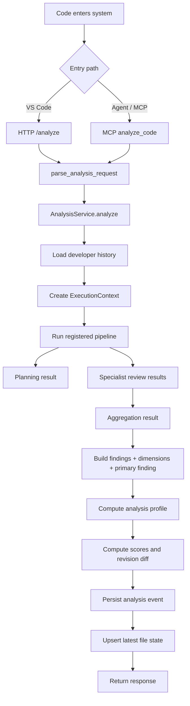
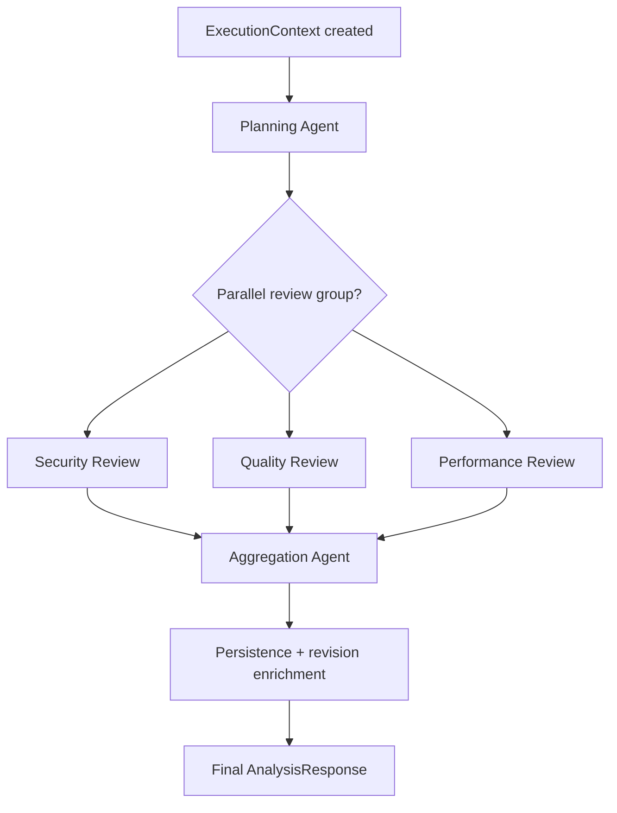
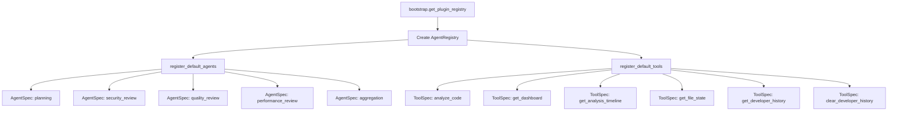
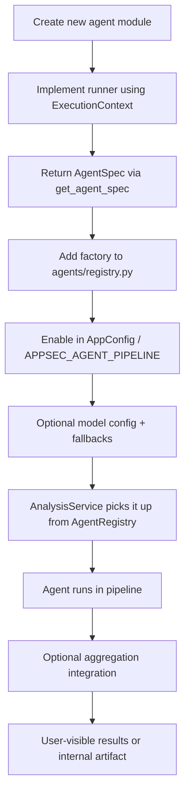
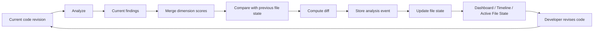
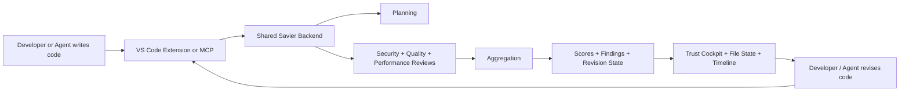

# Savier System Flow Diagram

This document captures the main architectural flows in Savier using Mermaid diagrams so they can be viewed directly in GitHub, Markdown viewers, or copied into presentation material.

## 1. High-Level System Architecture

### What this shows
- The VS Code extension and MCP clients both use the same backend trust engine.
- The backend is assembled through the bootstrap layer.
- The registry, provider, and repository are shared dependencies of the analysis service.
- Persistence is not an afterthought; it directly powers dashboard and revision-aware views.

## 2. Runtime Analysis Flow

### What this shows
- Both HTTP and MCP enter the same request normalization and analysis path.
- Analysis is context-aware because history is loaded before the pipeline runs.
- The returned result is not just findings; it also includes scores, revision diff, and analysis profile.

## 3. Agent Pipeline Flow

### What this shows
- Planning runs first and provides context.
- Specialist reviewers are independent and can run in parallel.
- Aggregation merges specialist outputs into one coherent trust result.
- Persistence and revision enrichment happen after aggregation.

## 4. Registry-Based Architecture

### What this shows
- Savier uses one registry object for both internal analysis stages and MCP-exposed tools.
- New agents and tools are added through registration, not by rewriting the whole server.
- This is the main extensibility mechanism in the current system.

## 5. How a New Agent Fits into the System

### What this shows
- New agents are added by registration and configuration.
- The analysis service does not need to be rewritten to support a new stage.
- A new stage can contribute internal artifacts, user-visible findings, or both.

## 6. Persistence and Revision-Aware Product Loop

### What this shows
- Savier is a feedback loop, not a one-shot scanner.
- Revision delta is a product feature built on top of persistence.
- The UI can prove improvement over time because state is stored between runs.

## 7. Suggested “Single Slide” Diagram for PPT
If you want only one diagram for a slide, this is the cleanest version:

### Suggested caption
Savier creates a closed trust loop where code is analyzed in context, judged across multiple dimensions, stored as revision-aware state, and fed back into the developer workflow.

## 8. Key Architectural Takeaways
- Savier uses a shared backend for both human and agent workflows.
- The system is registry-driven, which makes agent and tool addition clean.
- The pipeline is modular and supports parallel specialist reviews.
- Persistence makes the product revision-aware rather than stateless.
- The dashboard and timeline are powered by stored analysis state, not frontend-only logic.

